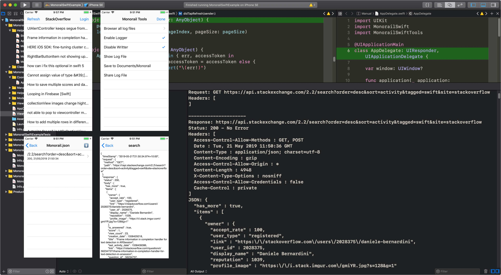

# Monorail

## Introduction

MonorailSwift is a troubleshooting/testing tool to log, record and replay network interactions for iOS project.

Inspired by [pact.io](http://pact.io) and lots of opensource projects.

## Requirment
Swift 4.1+, Xcode 9.3+, iOS 9.0+

## Features

1. Printout network interactions to debug terminal.
2. Save network interactions into json file in device/simulator
3. Share/send/browse log in device/simulator
4. Playback saved network interactions as response.  
5. Call out/dismiss MonorailSwiftTools menu by shaking devive or pressing Ctrl+Cmd+z in simulator

## How to use

### CocoaPods

pod 'MonorailSwiftTools', :configurations => ['Debug']

### Carthage

github "river2202/MonorailSwiftTools"

## Communication
- If you need any help, use [Stack Overflow](https://stackoverflow.com/questions/tagged/monorailswift) and tag `monorailswift`.

## Author

River2202@gmail.com

## License

Monorail is available under the MIT license. See the LICENSE file for more info.
